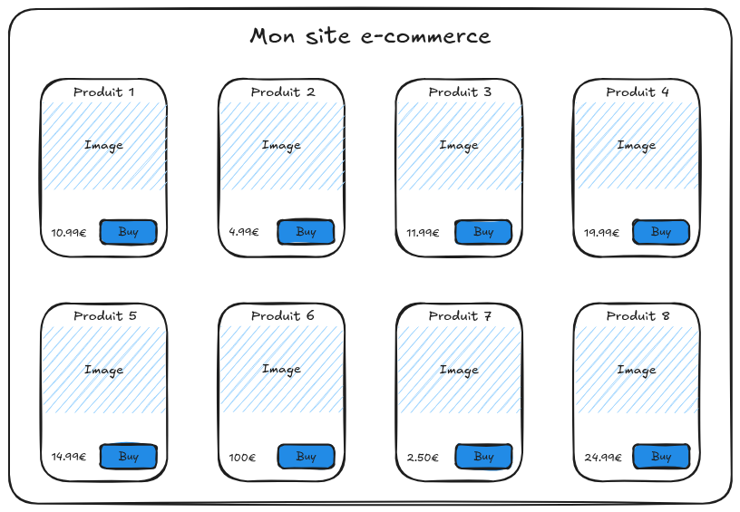
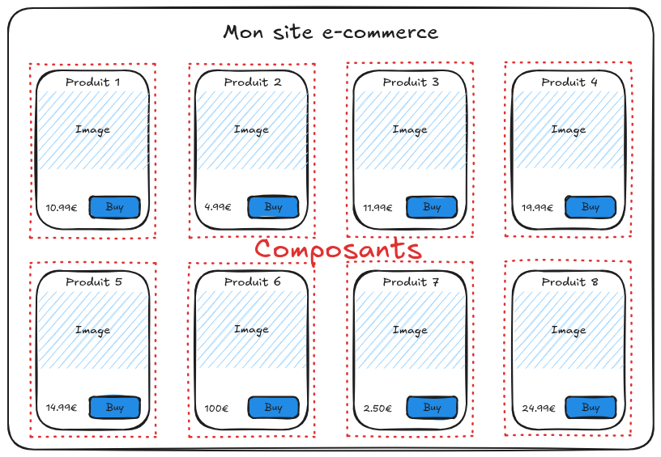

# VueJS - Composants

---

## Principe des composants

A quoi ça sert ?

---



---



---

## Les objectifs

- Augmenter la réutilisabilité des composants
- Simplifier la base de code
  - Réduire le risque de bug
  - Faciliter la maintenance

---

## Le découpage d'une carte en composants


---

## Déclarer un composant - SFC

Single File Component.  
Uniquement avec un outil de build.

```javascript
<script setup>
import { ref } from 'vue'

const count = ref(0)
</script>

<template>
  <p>{{ count }}</p>
  <button @click="count++">Increment</button>
</template>
```

---

## Déclarer un composant - JavaScript natif

Obligatoire sans outil de build.

```javascript
import { ref } from 'vue'

export default {
  setup() {
    const count = ref(0)
    return { count }
  },
  template: `
    <p>{{ count }}</p>
    <button @click="count++">Increment</button>
  `
}
```

---

## Déclarer un composant - JavaScript natif (suite)

Il est possible de spécifier l'id d'un élément HTML à la place du template pour utiliser cet élément comme source de template.
